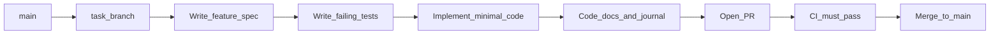

# Ride Replay — House Rules

> Personal C++ learning project. These rules exist to maximise **your** learning and produce **honest** resume evidence — not to ship fast with AI-generated code.

**Status:** Agreed draft — adjust as you learn what works.

---

## 1. Purpose

| Priority | Rule |
|----------|------|
| Learning | You write the code; struggle is part of the process |
| Quality | CI blocks merges that fail tests, formatting, or doc checks |
| Resume | Every merged feature is something you can explain in an interview |
| Pace | Small tasks, steady progress — no hero weeks |

---

## 2. AI assistance policy

**Default: no code generation.**

| You ask for… | AI may provide… | AI must NOT provide… |
|--------------|-----------------|----------------------|
| How to implement a feature | Pseudocode, steps, concepts, links to docs | `.cpp` / `.hpp` / CMake snippets |
| Debugging help | Questions to narrow the bug, what to log, where to look | A patched file |
| Code review | Feedback on *your* pasted code | Rewritten replacement |
| Roadmap / docs structure | Outlines, templates, polished wording of *your* notes | Feature implementations |
| Explicit request: "generate X" | Code for X only, scoped to that request | Entire phases or files "while we're at it" |

**Learning journal exception:** You write the substance (what you learned, tradeoffs, mistakes). AI may **only** tighten wording and fix typos — not add claims you didn't make.

---

## 3. Branching strategy

**One branch per task** from `main`. Task IDs match the roadmap checkboxes.

### Branch naming

```
task/<phase>-<short-slug>
```

Examples:
- `task/0-01-cmake-scaffold`
- `task/1-03-gpx-parser-trkpt`
- `task/4-02-shader-compile`

### Workflow per task



1. Branch from latest `main`
2. Write feature spec (see §6) — scope + acceptance criteria
3. Write failing tests (TDD)
4. Implement until tests pass
5. Add/update code documentation
6. Add learning journal entry (your words)
7. Open PR → CI green → self-review checklist → merge
8. Delete branch

**Rules:**
- Never commit directly to `main`
- One task = one PR (keep PRs small; if a task grows, split the roadmap checkbox)
- Rebase or merge `main` into your branch if it's stale before opening PR

---

## 4. TDD workflow

Every implementation task follows **Red → Green → Refactor**.

### Before writing production code

1. **Feature spec** in PR description or `docs/specs/<task-id>.md`:
   - Scope (what's in / out)
   - Public API shape (function names, types — not implementation)
   - Acceptance criteria (testable statements)

2. **Failing tests first** — commit tests in same PR before or as first commit on branch

3. **Minimal implementation** — only enough to pass tests

4. **Refactor** — only with all tests still green

### What must have unit tests

| Must test | May skip unit tests (document why) |
|-----------|-------------------------------------|
| Parsing, geo math, height sampling | OpenGL draw calls (manual visual check) |
| Pure functions, data transforms | GLFW window lifecycle |
| Trail snap logic | Shader string literals (compile check in CI optional) |
| CLI argument parsing | End-to-end PNG pixel-perfect comparison |

**OpenGL tasks:** Unit-test everything *extractable* (mesh vertex counts, normal calculation, height sampling). Visually verify in the app when automated tests aren't practical.

### Test naming convention

```
<UnitUnderTest>_<Scenario>_<ExpectedOutcome>
```

Example: `HaversineDistance_KnownPoints_MatchesReferenceWithinOneMetre`

---

## 5. CI/CD — merge gates

CI runs on every PR to `main`. **All jobs must pass to merge.**

### Planned GitHub Actions jobs

| Job | Tool | Blocks merge if… |
|-----|------|------------------|
| `build` | CMake (Debug + Release) | Compile fails |
| `test` | `ctest --output-on-failure` | Any test fails |
| `format` | `clang-format --dry-run` | Code not formatted |
| `tidy` | `clang-tidy` (on changed files) | Serious warnings (configurable) |
| `docs` | Custom script: public headers have `@brief` | Missing required doc comments |

### Branch protection (GitHub settings)

- [ ] Require PR before merging to `main`
- [ ] Require status checks: `build`, `test`, `format`, `docs`
- [ ] No force-push to `main`
- [ ] Dismiss stale reviews (N/A for solo — self-review checklist instead)

### Local pre-push (optional but recommended)

Install a git hook or run manually before push:

```bash
cmake --build build && ctest --test-dir build && clang-format --dry-run -Werror src/**/* tests/**/*
```

CI is the source of truth; local hooks catch issues early.

---

## 6. Documentation requirements

### 6.1 Code documentation

Every **public** symbol in `include/ride/` must have:

- `@brief` — one line, what it does
- `@param` / `@return` where applicable
- Non-obvious behaviour noted (e.g. units: metres, degrees)

Use **Doxygen-style** comments. CI `docs` job verifies `@brief` exists on public classes/functions.

**Internal** (`src/` only) functions: comment only when logic isn't self-explanatory.

### 6.2 Feature specs

Before each task, create `docs/specs/<task-id>.md`:

```markdown
# Task 1-03: GPX parser — track points

## Scope
- In: parse `<trkpt lat lon>` with optional `<ele>`, `<time>`
- Out: routes, waypoints, metadata

## Acceptance criteria
- [ ] AC1: ...
- [ ] AC2: ...

## Test plan
- test_gpx_parser.cpp: ...

## Notes
(link to journal entry after merge)
```

### 6.3 Learning journal

Path: `docs/journal/YYYY-MM-DD-<task-id>.md`

**You write:**
- What you learned (concepts, not just "it works")
- Decisions and tradeoffs you considered
- What surprised you or what you'd do differently
- Links to resources you used
- **Explain it** (required): 2–3 sentences describing what the task does, **without looking at the code** — interview prep

**AI role:** Polish grammar/spelling only. Must not invent experience or decisions.

Example prompt for polish: *"Tighten wording and fix typos only. Do not add new claims."*

---

## 7. Definition of Done (per task)

A roadmap checkbox may be marked `[x]` only when **all** apply:

- [ ] Feature spec written (or updated)
- [ ] Tests written first; all pass in CI
- [ ] Implementation complete within stated scope
- [ ] Public API documented (`@brief` etc.)
- [ ] Learning journal entry written by you (AI polish optional), including **Explain it** (2–3 sentences, no peeking at code)
- [ ] PR merged to `main`; branch deleted
- [ ] Roadmap checkbox updated in same PR or immediately after merge

---

## 8. Code style

| Topic | Convention |
|-------|------------|
| Standard | C++20 |
| Formatting | `.clang-format` (LLVM-based, project root) — CI enforces |
| Naming | `snake_case` functions/variables, `PascalCase` types, `kConstant` or `snake_case` for constants (pick one, stay consistent) |
| Headers | `#pragma once` |
| Includes | Own header first, then standard, then third-party |
| Ownership | Prefer `std::unique_ptr`; avoid raw `new`/`delete` |
| Files | One primary class per `.hpp`/`.cpp` pair where practical |

---

## 9. Commit messages

```
<type>(<scope>): <imperative summary>

[optional body]
```

Types: `feat`, `test`, `docs`, `refactor`, `chore`, `fix`

Examples:
- `test(gpx): add failing parser tests for empty track`
- `feat(geo): implement haversine distance`
- `docs(journal): phase 1 learnings`

---

## 10. PR self-review checklist

Copy into every PR description:

```markdown
## Task
- [ ] Roadmap ID: (e.g. 1-03)
- [ ] Feature spec linked

## TDD
- [ ] Tests committed before or with minimal implementation
- [ ] All tests pass locally

## Quality
- [ ] clang-format applied
- [ ] Public API documented
- [ ] No AI-generated code (unless explicitly noted)

## Learning
- [ ] Journal entry written (link)
- [ ] Explain it: 2–3 sentences without looking at code

## Manual verification (if applicable)
- [ ] (describe command run + result)
```

---

## 11. Data & privacy

- **Test fixtures:** Synthetic GPX only in repo
- **Personal rides:** `assets/gpx/` gitignored by default; use local paths
- **README:** Show output images, not raw GPS of home address
- Document heightmap bounds in sidecar JSON — no secrets

---

## 12. Repository files to create (Phase 0)

These support the rules above:

| File | Purpose |
|------|---------|
| `.clang-format` | Formatting standard |
| `.clang-tidy` | Lint rules (start permissive, tighten over time) |
| `.github/workflows/ci.yml` | Build, test, format, docs jobs |
| `.github/pull_request_template.md` | Self-review checklist |
| `docs/specs/` | Feature specs per task |
| `docs/journal/` | Your learning log (includes Explain it) |
| `scripts/check-docs.sh` | Fails if public headers lack `@brief` |

---

## 13. Quick reference card

```
Branch:     task/<phase>-<slug>  from main
Order:      spec → failing tests → implement → docs → journal → PR
CI:         must be green to merge
AI:         pseudocode & concepts only (unless you explicitly ask for code)
Journal:    you write → Explain it (no code peeking) → AI polishes wording only
Done:       checkbox on roadmap only after PR merged + journal exists
```

---

*Last updated: 2026-08-30*
